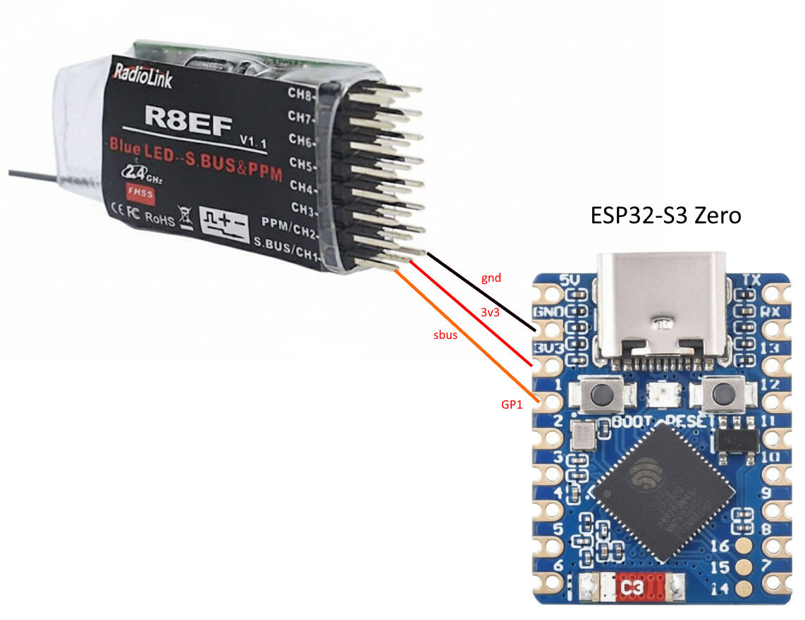

## ESP32-S3 SBUS → USB HID Gamepad (with CDC Debug)

[](https://github.com/yarreg/ESP32_USB_SBUS_Receiver/actions/workflows/firmware-build.yml)

Current firmware turns an ESP32‑S3 (native USB) into a composite USB device:

* HID Gamepad: 8 analog axes (mapped from SBUS channels) exported at full speed.
* CDC‑ACM Serial: text UI that periodically (every 50 SBUS frames) prints a live table of scaled axis values and button bitmap (currently always 0).

---

## Build firmware for your setup

Using github Actions, you can build firmware for your desired target, SBUS RX GPIO pin, and ESP-IDF version.

Link: [Build Firmware](https://github.com/yarreg/ESP32_USB_SBUS_Receiver/actions/workflows/param-build.yml)

---

## Features (Current)

* ESP‑IDF 5.5.x (component manager) + `esp_tinyusb` ~2.0.0
* Composite USB device: HID Gamepad + CDC‑ACM
* SBUS input (100 kbaud, 8E2, inverted RX) decoded into 16 channels
* 8 HID axes (X, Y, Z, Rx, Ry, Rz, Slider, Dial) sourced from selected SBUS channels
* Axis scaling: raw SBUS (approx 172..1811) clamped to 200..1800 then linearly re‑scaled to 0..2047 (11 bits placed into 16‑bit fields)
* Throttle axis reversed in code (see `sbus_channel_to_hid`)
* CDC text output: live ASCII “dashboard” refreshed every 50 frames (clears screen once, then cursor‑home updates)
* Clean, minimal TinyUSB descriptor for full‑speed composite (VID 0x303A / PID 0x4005 – Espressif example IDs; change for production)

---

## Hardware & Wiring (SBUS)


Target: Any ESP32‑S3 board with native USB (e.g. [ESP32‑S3 Zero](https://www.waveshare.com/wiki/ESP32-S3-Zero)). Only one SBUS RX pin is required right now.

Default pin (configurable):

* `SBUS_UART_RX_GPIO` default = GPIO 1.
   * Change via: `idf.py menuconfig` → "SBUS Receiver Options" → "SBUS UART RX GPIO" (or set `CONFIG_SBUS_UART_RX_GPIO` in `sdkconfig.defaults`).

Electrical notes:

* SBUS is inverted by protocol; code enables RX line inversion (`uart_set_line_inverse(..., UART_SIGNAL_RXD_INV)`). You still wire signal directly (no extra inverter) to the defined RX pin.
* Provide common ground between receiver and ESP32‑S3.

---

## USB Device Layout

Interfaces (Configuration 1):

1. HID Gamepad
   * Axes: X, Y, Z, Rx, Ry, Rz, Slider, Dial (8 x 16‑bit fields, logical range 0..2047)
   * Buttons (8 bits) currently always 0 (unused in code)
2. CDC‑ACM (Virtual COM Port)
   * Host can open COM port (any baud) to view periodic live telemetry table.
   * No bridging logic yet – purely output (no input required).

Descriptor source: see arrays `g_usb_device_desc`, `g_usb_config_desc`, and `g_usb_hid_report_desc` in `main/main.c`.

---

## Channel → Axis Mapping (Current Code)

Function: `sbus_channel_to_hid()`

```
HID Axis Index : Source SBUS Channel (0-based) : Meaning (comment)
0 (Yaw)        : ch[3]
1 (Throttle R) : ch[2] (reversed scaling)
2 (Roll)       : ch[0]
3 (Pitch)      : ch[1]
4 (A)          : ch[4]
5 (B)          : ch[5]
6 (C)          : ch[6]
7 (D)          : ch[7]
Buttons byte   : not populated (stays 0)
```

To change mapping: edit `sbus_channel_to_hid()`; to adjust scaling or inversion per axis edit `get_hid_value()` or pass `true` for `reverse`.

---

## Build & Flash (Windows / ESP-IDF 5.5+)

Prerequisites:
* ESP-IDF 5.5.x installed & environment exported (IDF Tools Manager or manual install)
* Python 3.8+
* USB cable with data lines (connect to native USB port of S3 – usually labeled USB or USB OTG)

Steps:
1. Set target (once): `idf.py set-target esp32s3`
2. Build: `idf.py build`
3. Flash + Monitor: `idf.py flash monitor`
4. After reset the board should enumerate as both a HID Gamepad and a USB Serial device.

Verification:
* Windows: Check Game Controllers (joy.cpl) → device should appear; axes move when you move sticks on SBUS transmitter.
* Serial Monitor: You will see a periodically updating table of axes every ~0.5–0.8 s (depends on SBUS frame rate).
* Online HID Test: (https://gamepadtest.com) – move sticks and see values change.

---

## Limitations / Known Issues

* No CRSF / ELRS parser yet – SBUS only.
* Buttons byte always 0 (no digital channel mapping implemented).
* No failsafe state exposure to host (you could map `failsafe` / `frame_lost` into a button bit).
* No dynamic protocol switching.
* CDC port is output-only (no command handling, no UART bridging / flashing function yet).
